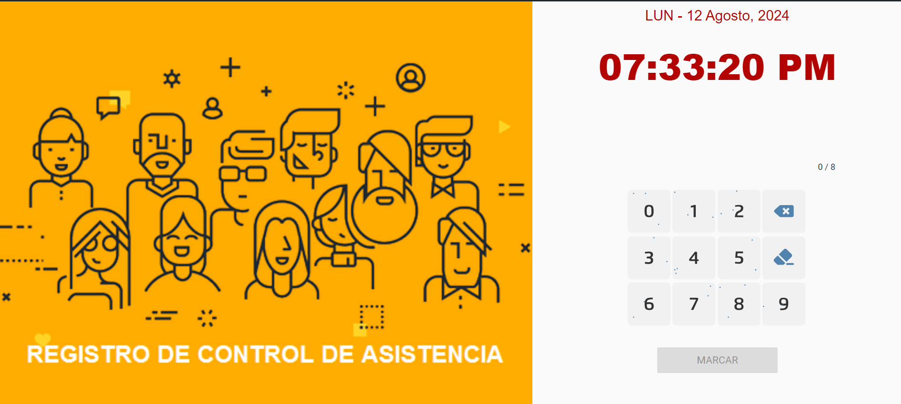

<h1 align="center">SISTEMA DE ASISTENCIA<br />
<div align="center">

</div>
</h1>
SISTEMA BÁSICO DE CONTROL DE ASISTENCIA WEB

## Características ✨

-	Backend: PHP 7.2+
-	Frondend: Angularjs y Bootstrap
-	Base de datos: MYSQL

## Modulos ✨

-	`Login:` El usuario ingresará con los datos generados por el sistema, se puede modificar una vez ingresado al sistema.
-	`Empleados:` Agrega y edita empleados, cada uno con multiple puestos, puede tener 1 a más puestos.
-	`Puestos:` Agrega o edita los puestos, cada uno con su respectivo sueldo.
-	`Horarios:` Agrega o desactiva su horario de entrada y salida.
-	`Reemplazos:` Una tercera persona puede remplazar a un empleado de la empresa.
-	`Adelantos:` Agrega, edita o elimina adelantos a cada empleado.
-	`Servicios:` Agrega, edita o elimina servicios, para tener un mejor manejo de sus gastos.
-	`Nómina de sueldos:` Visualiza las horas hombres que se ha laborado, y horas tarde de todos los empleados, más su sueldo neto.
-	`Marcar asistencia:` Marca asistencia con el número de DNI, funciona para pantallas táctiles y teclado numérico.


## Video Instructivo 📺
https://1drv.ms/v/c/5483765b870f0163/EWMBD4dbdoMggFSCAAAAAAABi4MWZFmZ7CCGIRsaK2EHBA?e=mOYhUN
## Configuración de la Base de Datos
Configura la conexión a la base de datos. Abre el archivo admin/config/class.Database.php y edita los siguientes valores:

```yaml
   private $_host = "localhost";
   private $_user = "root";
   private $_pass = "";
   private $_db   = "asistencia";
```

## Configuración de las vistas
admin\static\core\constants\constants.js
```
NOMBREEMPRESA: "INSTITUCIÓN", (Nombre de la isntitucion para el pdf)
BASE_HREF: "http://localhost/asistencia/admin/view/", (Vistas)
BACKGROUNDPDF: (aqui va la imagen de fondo del pdf)
    
```

## Usuari y contraseña

```yaml
   Usuario: SCRIPTNET
   Contraseña: cajlab12
    
```

